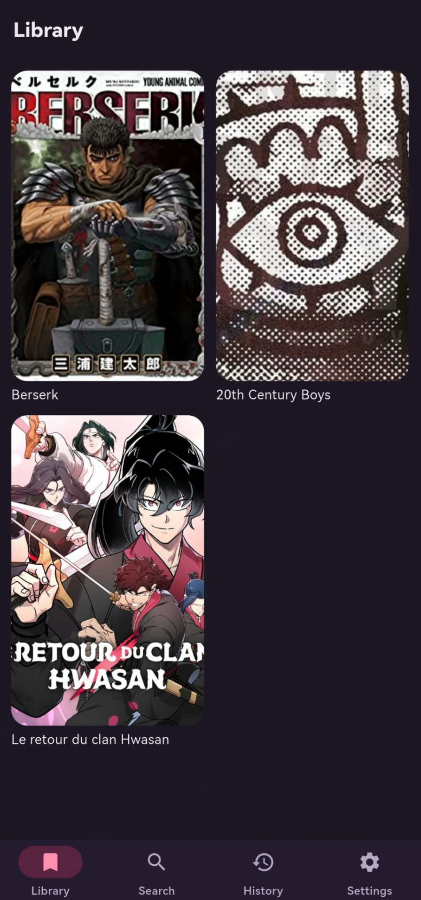
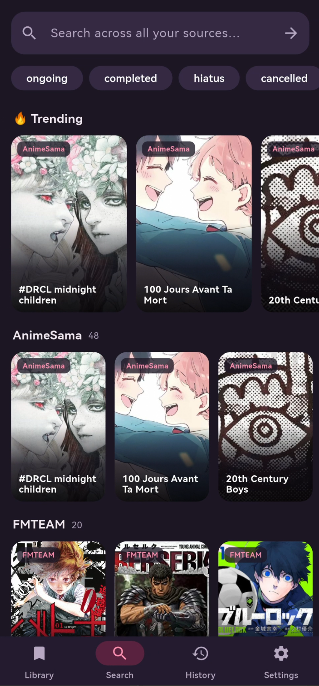

<div align="center">


# Yomira

**A clean, ad-free manga, manhwa & manhua reader for Android and Windows.**

Cross-device reading-progress sync. No ads. No tracking. No Google services.

[](LICENSE)
[](#self-hosting-required)

</div>

---

> ### This repository is the Yomira **app only**
> It ships **no content, no sources, and no server.** To use it you must run **your
> own** servers (a Suwayomi-Server and a sync backend) and point the app at them.
> There are **no public downloads** — build it yourself from the steps below.

## Screenshots

| Library | Search | Reader |
|:---:|:---:|:---:|
|  |  |  |

## Features

- Browse and read manga / manhwa / manhua from sources **you** configure
- Reading-progress sync across phone + desktop
- Distraction-free reader: vertical (webtoon) & horizontal (manga) modes,
  adjustable page width, hideable bars, image prefetch
- Smart history with "continue where you left off"
- Library / favorites
- Adaptive UI — native on Android, desktop layout on Windows
- Built-in update checker

## Privacy

- **No** Google Mobile Services, **no** Firebase, **no** FCM.
- **No** ads, **no** analytics, **no** trackers, **no** telemetry.
- The only Android permission is **INTERNET**.
- An account is optional and only used to **sync your reading progress** between
  your own devices.

See [PRIVACY.md](PRIVACY.md) and [SECURITY.md](SECURITY.md).

## Self-hosting (required)

Yomira is a **client**. It connects to two services you run yourself:

```
   Yomira app  ──►  Sync backend   (accounts + reading progress, over HTTPS)
               ──►  Suwayomi-Server (content + page images, over HTTPS)
```

Nothing works until both are up and the app's `.env` points at them.

### 1. Content server — Suwayomi-Server

Run a [Suwayomi-Server](https://github.com/Suwayomi/Suwayomi-Server) (Docker):

```bash
docker run -d --name suwayomi -p 4567:4567 \
  -v suwayomi:/home/suwayomi/.local/share/Tachidesk \
  ghcr.io/suwayomi/suwayomi-server:stable
```

Open `http://localhost:4567` and **configure the sources you want to use**. Yomira
talks to this server's GraphQL API (`/api/graphql`) and loads page images proxied
by it. Protect it with HTTP Basic Auth if it's exposed to the internet.

### 2. Sync backend (accounts + reading progress)

The app stores accounts and reading progress on a small backend (the reference
setup is Node/Express + PostgreSQL). **The backend is not included in this
repository — you provide your own.** It must expose these HTTPS endpoints that the
app calls:

| Method | Path | Purpose |
|---|---|---|
| POST | `/auth/register`, `/auth/login` | `{username,password}` → `{token, user}` |
| GET | `/auth/me` | current user (Bearer JWT) |
| GET | `/auth/verify` | 200 if the Bearer JWT is valid (used to gate Suwayomi) |
| GET / PUT | `/progress` | read / upsert reading progress |
| GET | `/library`, POST `/library`, DELETE `/library/:id` | favorites |
| GET | `/history`, DELETE `/history/:id` | reading history |
| GET | `/api/v1/app-status` | version check (reads `X-App-Version` / `X-Platform`) |

Auth is a Bearer JWT issued at login and stored in the device secure store.

### 3. HTTPS

Put both services behind a reverse proxy (e.g. **Caddy**) so the app talks
HTTPS only — cleartext is disabled in release builds. A common layout is one
host with the backend and Suwayomi on separate ports, each with a TLS cert.

### 4. Point the app at your servers

```bash
cp .env.example .env
```
Edit `.env`:
```
BACKEND_BASE_URL=https://your-host:3001
SUWAYOMI_BASE=https://your-host:4567
```
(`SUWAYOMI_USER`/`SUWAYOMI_PASS` only if you authenticate to Suwayomi directly
rather than via the backend.)

## Build from source

You need the Flutter SDK.

```bash
git clone https://github.com/TickrateFrance/Yomira.git
cd Yomira

cp .env.example .env          # then edit it (see "Self-hosting" above)

flutter create . --platforms=android,windows --org fr.tickrate
flutter pub get
dart run build_runner build --delete-conflicting-outputs

flutter build apk --release          # Android
flutter build windows --release      # Windows
```

> A build with the default `.env` points at `localhost` and will not connect to
> anything until you set your own servers.

## Tech

Flutter · Riverpod · go_router · dio · Isar (local DB) · cached_network_image ·
flutter_secure_storage (JWT in the Android Keystore — no GMS). Content is served
by a self-hosted [Suwayomi-Server](https://github.com/Suwayomi/Suwayomi-Server)
you run and configure.

## Disclaimer

The Yomira **software hosts and bundles no content** — it is a reader for sources
configured by whoever runs an instance. Any copyright concern about content served
by a specific instance must be directed to **that instance's operator and the
original source**, who control what is fetched and served. Please support official
releases where available.

## Credits & license

Made by **[Tickrate](https://tickrate.fr)** · Pralexio.
Released under the [MIT License](LICENSE).
